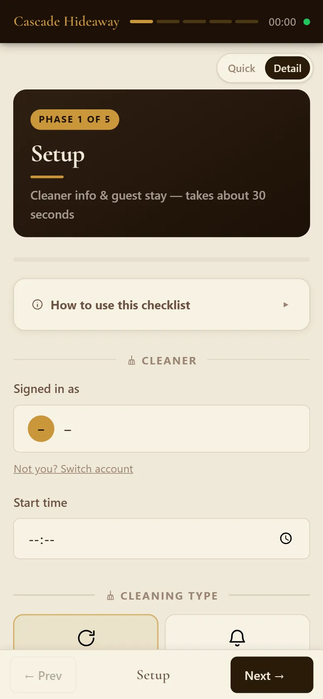
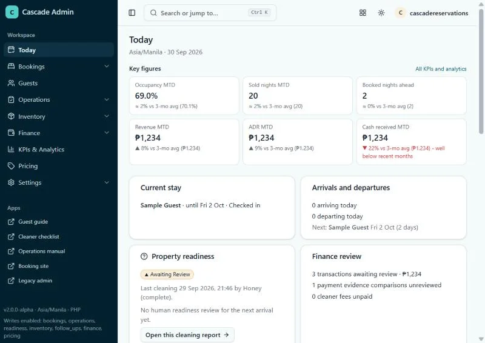

# Build contract - Cascade System Guide

Every lane follows this file. It is the only shared agreement between lanes.

## 1. Layout

```
index.html                 chooser (L1)
build.mjs                  zero-dependency Node build (L1). `node build.mjs` -> staff/index.html + admin/index.html
assets/guide.css guide.js icons.svg   (L1)
content/NNN-<id>.html      one chapter per file (content lanes)
content/glossary.json      {"term-id": {"term": "Turnover", "def": "..."}} (L5)
diagrams/*.svg, diagrams/*.html       (L7)
img/<surface>/<name>.webp  screenshots (orchestrator only)
staff/ admin/              BUILD OUTPUT - never hand-edit
research/                  inventories A-E, local only (gitignored), never published
```

## 2. Chapter file

File name `content/NNN-<id>.html` (NNN = order, zero-padded to 3). First thing in the file is a front-matter comment, then plain HTML (no `<html>`, `<head>`, `<body>`, `<script>`, `<style>`, no inline event handlers):

```html
<!--
id: s4-turnover
title: Doing a turnover with the Cleaner app
audience: both
roles: cleaner
order: 40
icon: broom
summary: Phase 0 to 4 in the Cleaner app, step by step.
-->
<p class="lead">...</p>
<h3 id="s4-phase-0">Phase 0 - Set up</h3>
...
```

- `audience`: `both` (staff AND admin build) or `admin` (admin build only).
- `roles`: `cleaner`, `office` or `all` (staff build role chips filter on this). Any element may also carry `data-roles="cleaner"` etc.
- The build writes the chapter `<h2>` from `title`. Fragments start at `<h3>`. Every `<h3>` and `<h4>` MUST have an `id` prefixed with the chapter prefix (`s4-...`, `a3-...`); ids are unique across the whole guide.
- Links: `href="#<chapter-id>"` or `href="#<section-id>"`. **Staff chapters (audience both) must never link to admin chapters** (a1-a9) - the build fails on a link that does not resolve in that build. External links only to the public sites listed in section 6.
- Images: `src="img/<surface>/<name>.webp"` (root-relative, no leading slash; the build rewrites it). Only use names from section 7. Every `` has a real `alt`.
- Includes: `<!-- include: diagrams/booking-flow.svg -->` on its own line is replaced by that file's contents.

Fixed chapter ids, orders and owners:

| id | order | owner | audience | roles |
|---|---|---|---|---|
| s0-welcome | 0 | L5 | both | all |
| s1-big-picture | 10 | L5 | both | all |
| s2-apps-logins | 20 | L5 | both | all |
| s3-manual-tour | 30 | L2 | both | cleaner |
| s4-turnover | 40 | L2 | both | cleaner |
| s5-power-safety | 50 | L2 | both | cleaner |
| s6-dashboard-tour | 60 | L3 | both | office |
| s7-booking-flow | 70 | L3 | both | office |
| s8-telegram | 80 | L4 | both | all |
| s9-cassy | 90 | L4 | both | all |
| s10-guests-messenger | 100 | L3 | both | office |
| s11-troubleshooting | 110 | L5 | both | all |
| s12-policies-glossary | 120 | L5 | both | all |
| s13-training | 130 | L5 | both | all |
| a1-architecture | 210 | L6 | admin | all |
| a2-roles-access | 220 | L6 | admin | all |
| a3-automations | 230 | L6 | admin | all |
| a4-ai-system | 240 | L6 | admin | all |
| a5-pricing-policy | 250 | L6 | admin | all |
| a6-finance-admin | 260 | L6 | admin | all |
| a7-keeping-running | 270 | L6 | admin | all |
| a8-known-limits | 280 | L6 | admin | all |
| a9-runbooks | 290 | L6 | admin | all |

Icons (front-matter `icon` and `<svg class="icon"><use href="#i-NAME"/></svg>`): home map phone book broom bolt dashboard calendar telegram chat guest alert policy check network key clock robot tag money wrench lifering camera search.

## 3. Components (L1 implements CSS + JS; content lanes only write this markup)

Everything must read sensibly with JS off and when printed.

1. **Callouts** `<aside class="callout tip|note|warn|danger"><p>...</p></aside>`
2. **Badges** `<span class="badge danger">Posts money at once</span>` `<span class="badge undo">Can undo</span>` `<span class="badge role">Owner</span>` `<span class="badge role">Cleaner</span>`
3. **Steps** `<ol class="steps"><li>...</li></ol>`
4. **Walkthrough** (one step per panel, progress bar, "Done" saved in the browser):
   ```html
   <div class="walkthrough" id="s4-wt-turnover">
     <div class="wt-step" data-title="Phase 0 - Set up">
         <!-- optional -->
       <p>...</p>
     </div>
   </div>
   ```
5. **Annotated screenshot** (numbered hotspots; JS turns each into a numbered pin + popover and ALWAYS also prints a numbered legend under the image):
   ```html
   <figure class="annotated">
     
     <span class="hotspot" data-x="" data-y="" data-title="Search" data-who="Owner, Admin" data-undo="n/a">Finds a booking, guest or report by name or code.</span>
     <figcaption>...</figcaption>
   </figure>
   ```
   Leave `data-x`/`data-y` empty (the orchestrator places pins after capture; empty = legend only). `data-undo`: `yes`, `no` or `n/a`.
6. **Telegram card replica** (tapping a button shows what happens - no real sends):
   ```html
   <div class="tg-card" data-group="Finance">
     <div class="tg-text">🟡 ATTENTION · receipt waiting<br>Sample Guest · CH-SAMPLE ...</div>
     <div class="tg-buttons">
       <button type="button" class="tg-btn" data-who="Mapped staff" data-danger="Confirms the booking and sends the guest message">Confirm booking</button>
       <button type="button" class="tg-btn" data-who="Anyone in the group">Decline</button>
     </div>
     <div class="tg-result">What happens when Confirm booking is tapped, in plain words.</div>
     <div class="tg-result">What happens when Decline is tapped.</div>
   </div>
   ```
   One `.tg-result` per button, same order. `data-group` is `Finance` or `OPS`. `data-danger` (optional) = short warning shown in red.
   Messenger bubbles: `<div class="msg-thread"><p class="msg guest">...</p><p class="msg bot">...</p></div>`.
7. **Decision tree**:
   ```html
   <div class="dtree" id="s11-dt-alert">
     <div class="dt-node" data-node="start"><p class="dt-q">What did you get?</p>
       <button type="button" data-go="red">A red ALERT card</button></div>
     <div class="dt-node" data-node="red"><p>Do this ...</p></div>
   </div>
   ```
8. **Glossary term** `<span class="term" data-term="turnover">turnover</span>` - the id must exist in `content/glossary.json`. Starter ids (L5 defines all of them): turnover, mid-stay, deep-clean, hold, reservation-fee, deposit, balance, handoff, rate-card, promo, confirm-and-leave, meter-skip, supply-log, dwell-time, brownout, ecoflow, cassy, concierge, finance-group, ops-group, mapped-staff, draft, stay-picker, heartbeat, verifier, digest, ledger, work-order, notice, inquiry.
9. **Task finder** `<div class="task-finder"><a class="task" href="#s4-turnover" data-roles="cleaner"><strong>Do a turnover</strong><span>Phase 0 to 4</span></a></div>`
10. **Checklist** (ticks saved in the browser) `<ul class="checklist" id="s13-ready"><li><label><input type="checkbox"> I can ...</label></li></ul>`
11. **Timeline** `<ol class="timeline"><li data-time="07:30" data-group="OPS"><strong>Meter-photo check</strong> ...</li></ol>`
12. **Tables** plain `<table>` with `<thead>`; the build wraps them for horizontal scroll on phones.
13. **Figures/diagrams** `<figure class="diagram"><!-- include: diagrams/x.svg --><figcaption>...</figcaption></figure>`

## 4. Writing rules (all content lanes)

- Documents TODAY's behaviour. Bugs/oddities in plan section 7 are NOT fixed here; say what the reader should do about them ("tap once", "this button acts at once, there is no confirm"). The full list goes only in a8-known-limits.
- Plain English, short sentences, second person ("Tap **Submit Now**."). Staff readers read English as a second language: simple words, one idea per sentence. Calm tone, no exclamation marks, no hype.
- Button and screen names **exactly** as the UI shows them, in bold.
- Times are Manila time (write "08:00"). Money as "PHP 1,000".
- Visual first: every chapter has at least one component from section 3 besides callouts.
- Source of truth: inventories A-D (verified against code). Inventory E was written by a cheaper model - do NOT trust it where it disagrees with A-D; its AI-model line, its "48-hour hold" and its scheduled-message list are wrong. Guest replies run on google/gemini-2.5-flash via OpenRouter. Direct-booking holds release after 24 h unpaid. Policies: the booking site is the source (50% reservation fee, PHP 1,000 security deposit due with the balance one day before check-in, 5-day refund rule, check-in 2 PM, check-out 12 noon).

## 5. NEVER in any published file (the audit greps for these)

PINs or any PIN digits, door codes, Wi-Fi name or password, bank account / GCash numbers, API keys or tokens, **secret or env-var NAMES** (anything like `TELEGRAM_*`, `CASCADE_*_KEY`, `*_SECRET`), Telegram chat ids, the Supabase project ref or `*.supabase.co` URLs, SQL runner/script names, file paths (`C:\...`, `F/...`, `SS/...`, `src/...`), line-number citations, admin/dashboard/n8n/Apps Script URLs, internal host names (alfred, tunnels), real guest names/phones/e-mails, real amounts tied to a guest, real staff surnames. Staff first names only (Lloyd, Marifel, Honey) and "the owner".
Allowed: the public e-mail cascadereservations@gmail.com, the public guest phone the site shows, and the public URLs in section 6.
Sample data in examples: "Sample Guest", "0917 000 0000", "guest@example.com", "CH-SAMPLE" / "DIR-SAMPLE".
Admin chapters name systems, never credentials; for anything sensitive write "see the vault note <name>".

## 6. Public URLs you may link

- Booking site https://cascadereservations-del.github.io/Stay_At_CascadeGSC/
- Guest guide https://cascadereservations-del.github.io/Welcome-To-Cascades-/
- Operations Manual https://cascadereservations-del.github.io/Cascade-Manual/
- Cleaner app https://cascadereservations-del.github.io/CH-Cleaners-Checklist/
- Cascade Staff app https://cascadereservations-del.github.io/Cascade-Staff/
- Messenger https://m.me/cascade.hideaway
(The admin dashboard is named, never linked.)

## 7. Screenshot names (orchestrator captures; reference only these)

- `img/site/hero.webp` `img/site/booking-form.webp` `img/site/payment.webp`
- `img/guide/gate.webp` `img/guide/welcome.webp`
- `img/manual/login.webp` `img/manual/dashboard.webp` `img/manual/cleaning.webp` `img/manual/sops.webp`
- `img/cleaner/signin.webp` `img/cleaner/phase-0.webp` `img/cleaner/phase-1.webp` `img/cleaner/phase-2.webp` `img/cleaner/phase-3.webp` `img/cleaner/supply-log.webp` `img/cleaner/phase-4.webp` `img/cleaner/submit.webp`
- `img/dashboard/signin.webp` `img/dashboard/today.webp` `img/dashboard/bookings.webp` `img/dashboard/calendar.webp` `img/dashboard/inquiries.webp` `img/dashboard/booking-detail.webp` `img/dashboard/guests.webp` `img/dashboard/cleaning-log.webp` `img/dashboard/cleaning-report.webp` `img/dashboard/stock.webp` `img/dashboard/finance-review.webp` `img/dashboard/pricing.webp` `img/dashboard/staff.webp` `img/dashboard/health.webp` `img/dashboard/cleaner-view.webp`
- `img/standard/bed.webp` `img/standard/room.webp` `img/standard/living.webp` `img/standard/tv-wall.webp` `img/standard/remote-tray.webp` `img/standard/kitchen.webp` `img/standard/kitchen-shelf.webp` `img/standard/sink.webp` `img/standard/bathroom.webp` `img/standard/laundry.webp` `img/standard/entrance.webp`

A missing image renders as a labelled placeholder, so reference freely from this list.

## 8. Admin-only blocks inside shared chapters (added 2026-10-01, Lloyd)

The staff guide must not show anything meant for the owner/admins. Wrap such parts of a shared (audience both) chapter:

```html
<!-- admin -->
<h3 id="s6-owner-pages">Pages for the owner and admins</h3>
...
<!-- /admin -->
```

The staff build removes everything between the markers; the admin build keeps it. Markers must pair up. A staff link
(`href="#..."`) to an id inside a removed block fails the staff build, so remove or wrap that link too.
